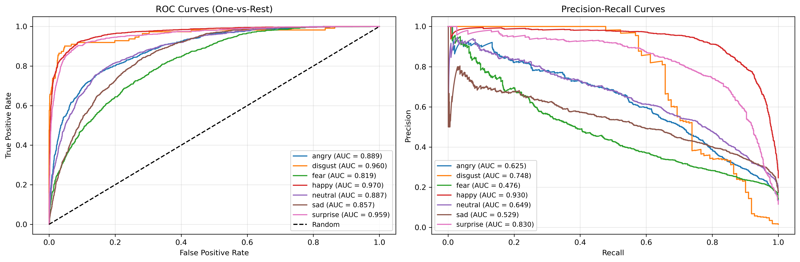
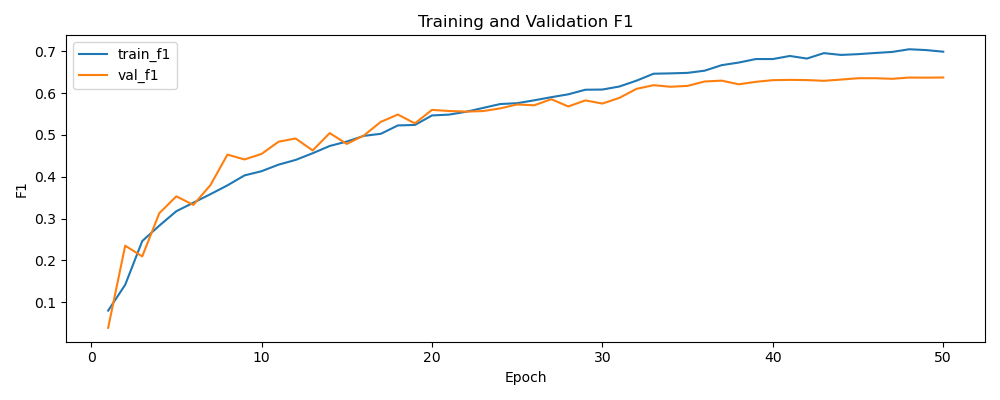

# FER-2013

A deep learning architecture for classifying facial emotions, learning from FER-2013 dataset.

## Project Structure

```bash
fer-2013
.
├── checkpoints
├── configs
│   └── config.yaml
├── data
│   └── raw
│       ├── test
│       └── train
├── environment.yaml
├── LICENSE
├── main.py
├── notebooks
│   ├── 01_eda.ipynb
│   └── 02_evaluation.ipynb
├── README.md
├── src
│   ├── config.py
│   ├── data
│   │   ├── dataset.py
│   │   ├── fetch_data.py
│   │   └── __init__.py
│   ├── focal_loss
│   │   ├── focal_loss.py
│   │   └── __init__.py
│   └── model
│       ├── callbacks.py
│       ├── eval.py
│       ├── __init__.py
│       ├── model.py
│       └── train.py
└── tests
```

## Setup

```bash
conda env create -f environment.yml
conda activate fer-2013
```

## Run

```bash
python -m main
```

## Model Performance

The model achieves **65.0% accuracy** on the FER-2013 test set with the following per-class metrics:

| Emotion | Precision | Recall | F1-Score | Support |
|---------|-----------|--------|----------|---------|
| Angry | 0.5713 | 0.5939 | 0.5824 | 958 |
| Disgust | 0.6789 | 0.6667 | 0.6727 | 111 |
| Fear | 0.5000 | 0.3730 | 0.4273 | 1024 |
| Happy | 0.8692 | 0.8388 | 0.8537 | 1774 |
| Neutral | 0.5733 | 0.7105 | 0.6346 | 1233 |
| Sad | 0.5384 | 0.4667 | 0.5000 | 1247 |
| Surprise | 0.7034 | 0.8363 | 0.7642 | 831 |

**Macro Average**: Precision=0.6335, Recall=0.6409, F1=0.6335

## Evaluation Results

### Confusion Matrix

The confusion matrix shows the model's predictions across all emotion categories (normalized by true values):


### ROC and Precision-Recall Curves

One-vs-rest ROC and precision-recall curves for each emotion class:



### Training History

Loss and F1 score curves across training epochs:




## Key Findings

- **Best Performance**: Happy emotion achieves the highest F1-score (0.8537)
- **Most Challenging**: Fear emotion has the lowest recall (0.3730)
- **Balanced Results**: The model shows consistent macro-average metrics, indicating reasonable generalization across emotion classes
- **Strong Specificity**: The model maintains good precision for emotions like Happy (0.8692) and Surprise (0.7034)
- **Confusion between classes**: classes with lowest metrics are often confounded with similar but subtetly different emotions.

## Next Questions

- What can we do to improve our results?

## License

This project is under MIT license [LICENSE](./LICENSE).
