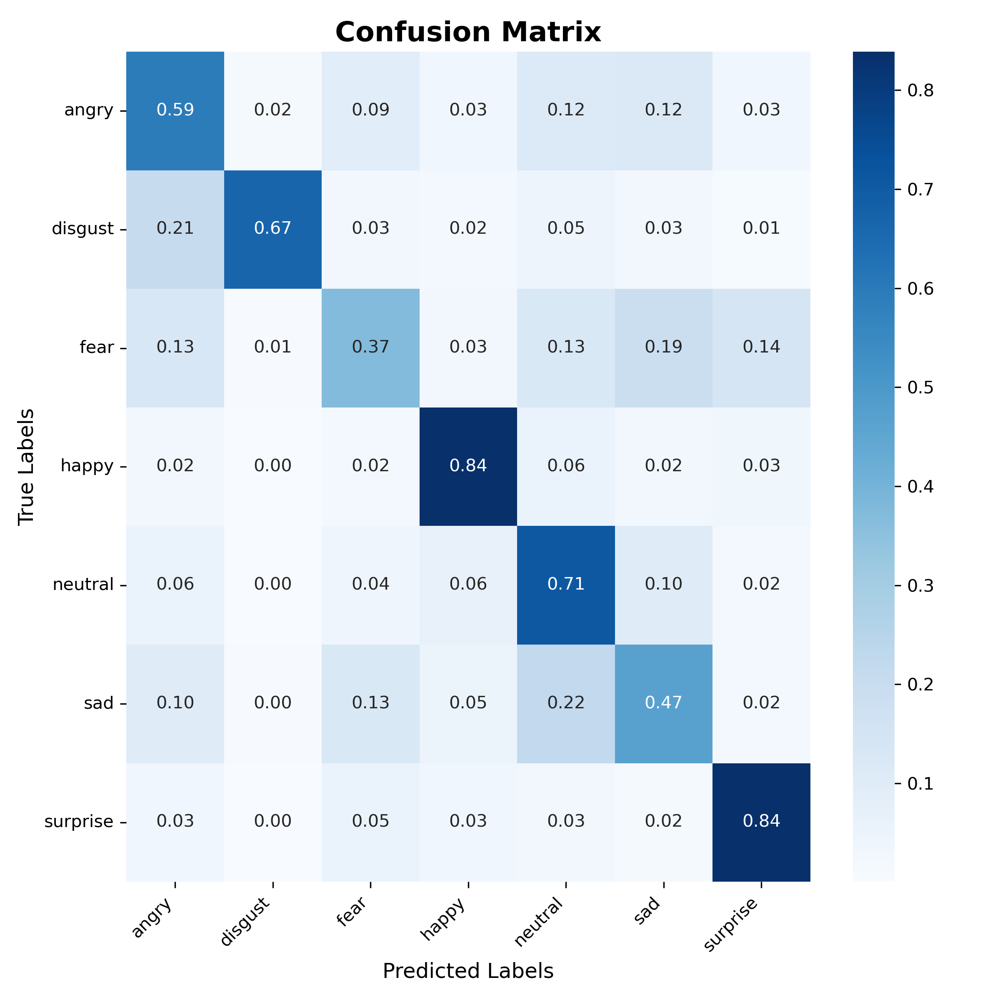
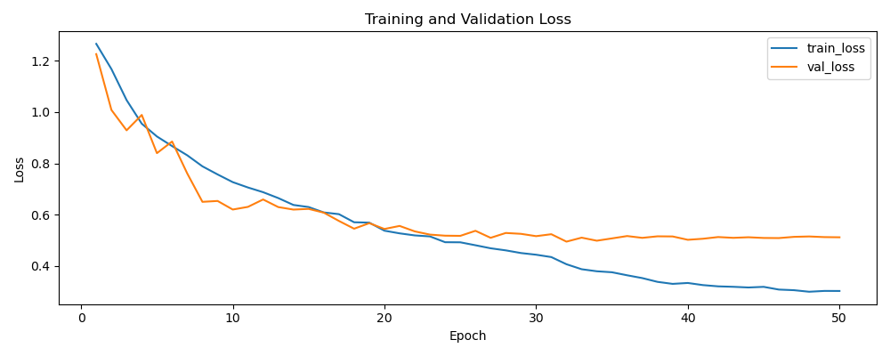

# FER-2013

A deep learning architecture for classifying facial emotions, learning from FER-2013 dataset.

## Project Structure

```bash
fer-2013
.
├── checkpoints
├── configs
│   └── config.yaml
├── data
│   └── raw
│       ├── test
│       └── train
├── environment.yaml
├── LICENSE
├── main.py
├── notebooks
│   ├── 01_eda.ipynb
│   └── 02_evaluation.ipynb
├── README.md
├── src
│   ├── config.py
│   ├── data
│   │   ├── dataset.py
│   │   ├── fetch_data.py
│   │   └── __init__.py
│   ├── focal_loss
│   │   ├── focal_loss.py
│   │   └── __init__.py
│   └── model
│       ├── callbacks.py
│       ├── eval.py
│       ├── __init__.py
│       ├── model.py
│       └── train.py
└── tests
```

## Setup

```bash
conda env create -f environment.yml
conda activate fer-2013
```

## Run

```bash
python -m main
```

## Model Performance

### Custom CNN Architecture (Current)

Our custom CNN architecture achieves **65.0% accuracy** on the FER-2013 test set, significantly outperforming the ResNet18 backbone variant by **11.9 percentage points**.

**Performance comparison:**
- **Custom CNN**: 65.0% accuracy (F1: 0.6335)
- **ResNet18 Backbone**: 53.1% accuracy (F1: 0.5244)
- **Improvement**: +11.9% absolute accuracy gain

This demonstrates that **purpose-built architectures can outperform transfer learning** for specialized tasks like facial expression recognition on low-resolution (48×48) grayscale images. The custom architecture's design, optimized for FER-2013's characteristics, proves more effective than adapting a general-purpose ImageNet-pretrained backbone.

### Detailed Metrics (Custom CNN)

| Emotion | Precision | Recall | F1-Score | Support |
|---------|-----------|--------|----------|---------|
| Angry | 0.5713 | 0.5939 | 0.5824 | 958 |
| Disgust | 0.6789 | 0.6667 | 0.6727 | 111 |
| Fear | 0.5000 | 0.3730 | 0.4273 | 1024 |
| Happy | 0.8692 | 0.8388 | 0.8537 | 1774 |
| Neutral | 0.5733 | 0.7105 | 0.6346 | 1233 |
| Sad | 0.5384 | 0.4667 | 0.5000 | 1247 |
| Surprise | 0.7034 | 0.8363 | 0.7642 | 831 |

**Macro Average**: Precision=0.6335, Recall=0.6409, F1=0.6335

## Evaluation Results

### Confusion Matrix

The confusion matrix shows the model's predictions across all emotion categories (normalized by true values):



### ROC and Precision-Recall Curves

One-vs-rest ROC and precision-recall curves for each emotion class:


### Training History

Loss and F1 score curves across training epochs:




## Key Findings

- **Best Performance**: Happy emotion achieves the highest F1-score (0.8537)
- **Most Challenging**: Fear emotion has the lowest recall (0.3730)
- **Balanced Results**: The model shows consistent macro-average metrics, indicating reasonable generalization across emotion classes
- **Strong Specificity**: The model maintains good precision for emotions like Happy (0.8692) and Surprise (0.7034)
- **Confusion between classes**: classes with lowest metrics are often confounded with similar but subtetly different emotions.

## Architecture Comparison: Custom CNN vs ResNet18

We experimented with replacing our custom CNN with a ResNet18 backbone to investigate whether transfer learning could improve performance. **The results clearly favor the custom architecture:**

| Metric | Custom CNN | ResNet18 | Difference |
|--------|------------|----------|------------|
| **Accuracy** | **65.0%** | 53.1% | **+11.9%** |
| **Weighted F1** | **0.6335** | 0.5244 | **+0.1091** |
| **Happy F1** | **0.8537** | 0.7686 | **+0.0851** |
| **Fear F1** | **0.4273** | 0.2649 | **+0.1624** |

### Why Custom CNN Outperforms ResNet18

1. **Resolution Mismatch**: ResNet architectures are designed for higher-resolution images (224×224+), while FER-2013 uses 48×48 images. The aggressive downsampling in ResNet's early layers destroys critical facial details.

2. **Task-Specific Design**: Our custom architecture uses properly-sized conv blocks optimized for 48×48 input, preserving spatial information throughout the network.

3. **Simpler is Better**: For this constrained problem (low resolution, grayscale, limited classes), a purpose-built shallow architecture captures relevant patterns more effectively than a deep, general-purpose backbone.

4. **Gabor Features**: Our custom pipeline integrates Gabor filters for texture extraction, which complements the learned features better than ResNet's standard convolutions.

**Conclusion**: While transfer learning is powerful, domain-specific architecture design remains crucial for specialized computer vision tasks, especially with non-standard input characteristics.

## License

This project is under MIT license [LICENSE](./LICENSE).
